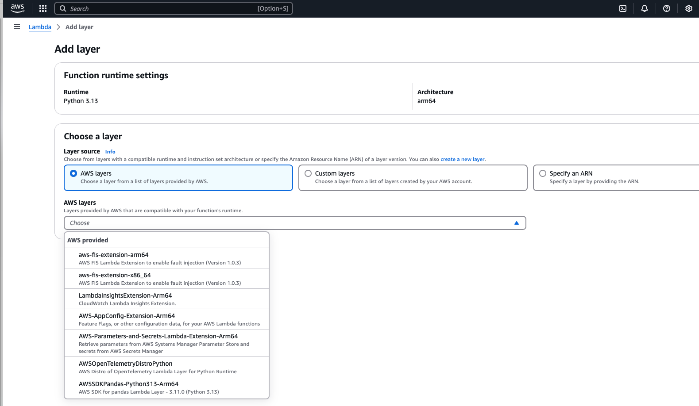

# deploy-classification-endpoint
Highlights the differences in processes between basic zip upload vs Docker when deploying model endpoint in aws lambda. 
Steps in this project:
1. Create a simple classification model using the iris data set, then save the trained model as a .pkl file
- The trained model will be used to generate new predictions on unseen data. For this, the model will be made available as an aws lambda endpoint triggered on a data file upload in a specified S3 bucket, then return the predictions as a csv file to another S3 bucket for downstream tasks.
2. Set up deployment:
- Create a lambda function file that contains:
a. methods to load the saved model and run the model on new data.
b. lambda handler that defines the event (.csv file upload to S3 bucket) and calls the methods to generate predictions on the new data and save the predictions in another S3.
3. Set up AWS IAM user permissions for lambda access, S3 read-write access
4. Create zip file with requirements.txt file containing packages required for lambda function
5. Upload zip file to Lambda
# 1/15/2025 Update
This project was initially supposed to highlight the differences between using zipped project uploaded to lambda vs using Docker image and EC2. I learned after lot's of trial and error that 
1. There is an aws layer for pandas/arm64 architecture:

2. Even small ML models like this require packages that are too large for Lambda even using layers. I figured this out when trying to package scikit-learn in a layer.

Next Steps:
1. Containerize model endpoint for predictions
2. Create AWS ECR repository and push Docker image
3. Use container image as the source for lambda function